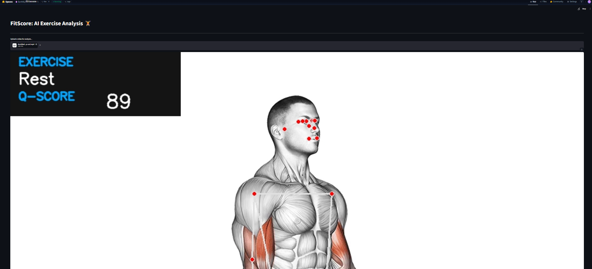
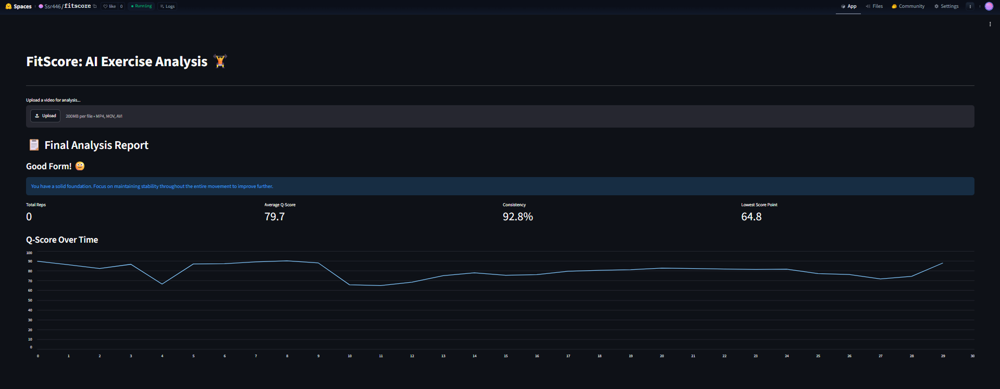

# FitScore: AI-Powered Exercise Analysis 🏋️

[](https://huggingface.co/spaces/Ssr446/fitscore)
[]()
[]()
[]()

<!-- 🖼️ PLACEHOLDER: HERO IMAGE / BANNER (Upload your image to the 'assets' folder and name it 'hero_banner.png') -->
<div align="center">
  
</div>

<br>

**FitScore** is an advanced, AI-powered fitness analysis tool that leverages computer vision to evaluate exercise form in real-time. By analyzing video input, it detects human body landmarks, compares the user's biomechanical form against idealized prototype poses, and calculates a dynamic **Q-Score** to provide actionable, frame-by-frame feedback.

---

## 🌟 Live Demo
Experience the live application deployed on Hugging Face Spaces with 16GB hardware acceleration:

👉 **[Try FitScore Live Here](https://huggingface.co/spaces/Ssr446/fitscore)**

<!-- 🖼️ PLACEHOLDER: APPLICATION DEMO GIF / SCREENSHOT (Upload your GIF to the 'assets' folder and name it 'demo.gif') -->
<div align="center">
  <br>
  
  <p><i>Example of FitScore evaluating exercise form in real-time.</i></p>
</div>

---

## ✨ Key Features
- **Real-Time Pose Detection:** Utilizes Google's MediaPipe for highly accurate, 33-point 3D human pose estimation.
- **Biomechanical Form Evaluation:** Computes real-time Q-Scores using cosine similarity against normalized prototype skeletons.
- **Automated Rep Counting:** Tracks joint angles dynamically to count repetitions without manual intervention.
- **Dual Architecture:** Choose between a lightweight **Streamlit web application** for quick visualization or a robust **FastAPI backend** for custom integrations.

---

## 🛠️ Installation & Local Development

1. **Clone the repository:**
   ```bash
   git clone https://github.com/Ssr446/fitscore_project1.git
   cd fitscore_project1
   ```

2. **Create a virtual environment (Recommended):**
   ```bash
   python -m venv venv
   # On Windows:
   venv\Scripts\activate
   # On macOS/Linux:
   source venv/bin/activate
   ```

3. **Install the dependencies:**
   ```bash
   pip install -r requirements.txt
   ```

---

## 💻 Usage

You have two options for running the application locally:

### Option 1: Streamlit App (Recommended)
Provides a rich, interactive web interface for uploading videos and viewing frame-by-frame analysis.
```bash
streamlit run app.py
```

### Option 2: FastAPI + Custom Frontend
Runs a robust REST API backend with a separate static frontend.
```bash
uvicorn server:app --host 0.0.0.0 --port 8000 --reload
```
Once the server is running, navigate to `http://localhost:8000/` to access the custom interface.

---

## 🚀 Deployment Architecture (Hugging Face Spaces)
This repository is pre-configured for automated CI/CD deployment to **Hugging Face Spaces**.

The `.github/workflows/sync-to-hub.yml` GitHub Action automatically handles:
1. Installing Git LFS in the deployment runner.
2. Dynamically migrating heavy binary files (`model.pkl`, `.png`) to Large File Storage.
3. Authenticating and force-pushing updates directly to the live Hugging Face Space.

*(Requires `HF_TOKEN` configured in GitHub Repository Secrets).*

---

## 📂 Project Structure
- `app.py`: Main Streamlit application interface.
- `server.py`: FastAPI backend interface.
- `training_notebook.ipynb`: Core Jupyter notebook used for generating ML models and prototype pose skeletons.
- `model.pkl`: Compiled Scikit-Learn Random Forest model.
- `prototype_poses_normalized.csv`: Pre-calculated biomechanical ideal forms.
- `packages.txt`: Defines system-level Linux dependencies (`libgl1`, `ffmpeg`) for cloud environments.

---
## 📝 License
MIT License
